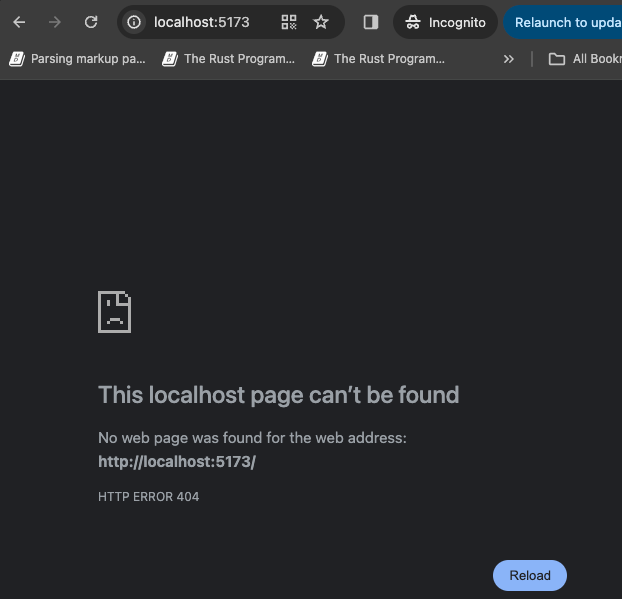

# Vite Dev Server Bug Repro

This is a minimal reproduction of a bug in Vite's dev server.

## The bug

If there is no index.html file in the root of the project, the dev server will silently fail and output nothing.

### Steps to reproduce

1. Run `yarn create vite@latest` and select React + TS template
2. Delete the `index.html` file in the root of the project
3. Run `yarn install`
4. Run `yarn dev` (opens on http://localhost:5173 by default)
5. Open the browser and navigate to http://localhost:5173
    6. Result: Nothing is displayed in the browser
   7. 

